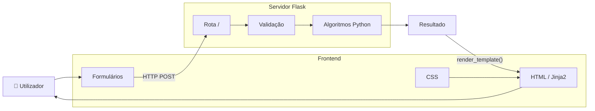
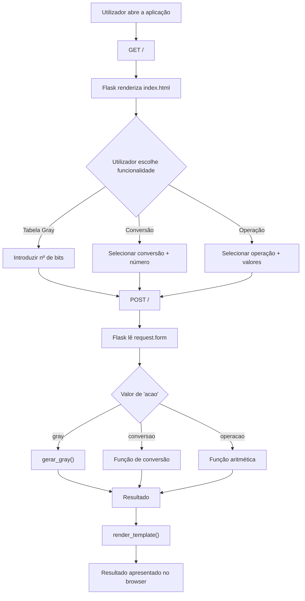
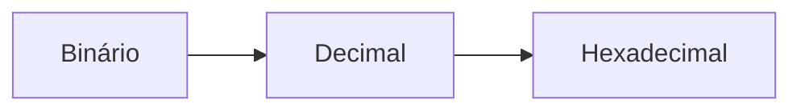
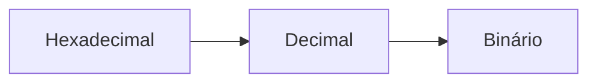
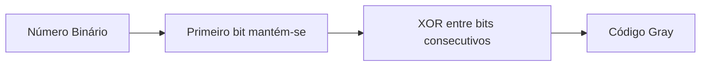
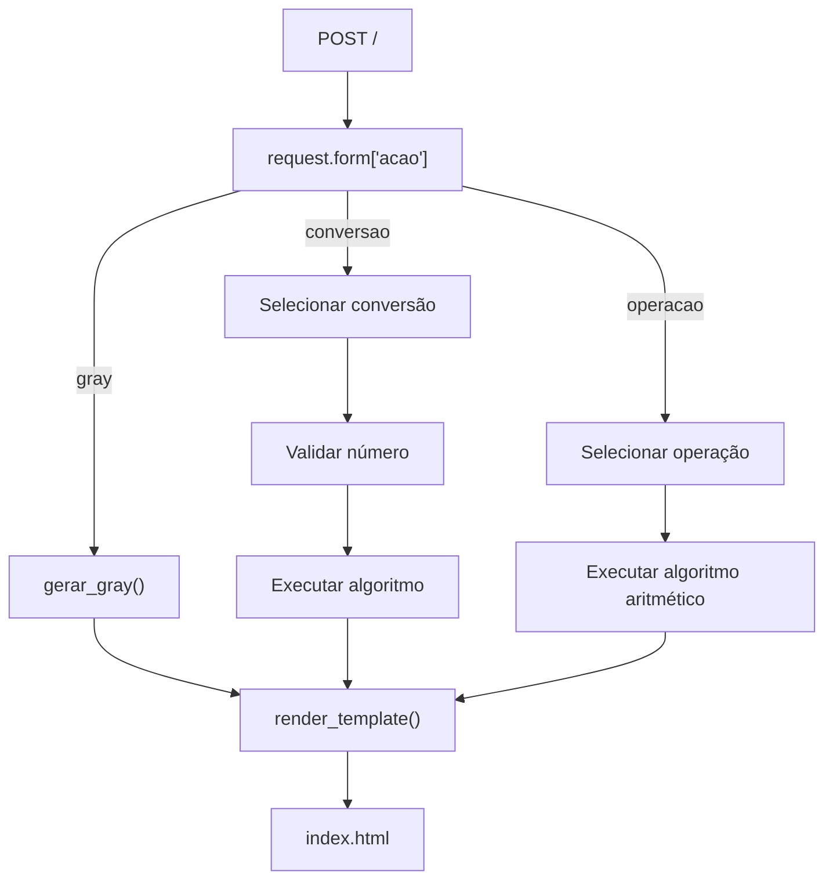
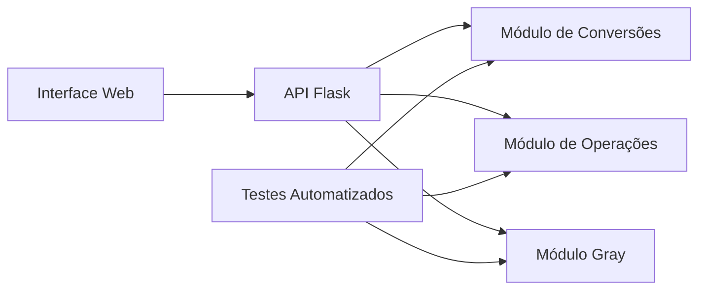

# 🔢 Sistemas Numéricos com Flask


Aplicação web desenvolvida em **Python com Flask** para exploração e manipulação de diferentes **sistemas de numeração**.

A aplicação permite realizar conversões entre os sistemas **binário, decimal e hexadecimal**, executar operações aritméticas diretamente sobre números binários e hexadecimais e gerar tabelas de **Código Gray** para um determinado número de bits.

Um dos principais objetivos do projeto foi implementar manualmente os algoritmos utilizados nas conversões e operações, permitindo compreender o funcionamento interno dos diferentes sistemas numéricos em vez de depender exclusivamente das funções de conversão disponibilizadas pela linguagem Python.

---

## 📑 Índice

- [Contexto Académico](#-contexto-académico)
- [Sobre o Projeto](#-sobre-o-projeto)
- [Objetivos](#-objetivos)
- [Arquitetura](#️-arquitetura)
- [Funcionamento da Aplicação](#-funcionamento-da-aplicação)
- [Funcionalidades](#️-funcionalidades)
- [Conversões Numéricas](#-conversões-numéricas)
- [Operações Binárias](#-operações-binárias)
- [Operações Hexadecimais](#-operações-hexadecimais)
- [Código Gray](#-código-gray)
- [Validação de Dados](#-validação-de-dados)
- [Flask e Processamento dos Pedidos](#-flask-e-processamento-dos-pedidos)
- [Interface Web](#️-interface-web)
- [Tecnologias Utilizadas](#️-tecnologias-utilizadas)
- [Estrutura do Projeto](#-estrutura-do-projeto)
- [Instalação](#-instalação)
- [Execução](#️-execução)
- [Exemplos](#-exemplos)
- [Complexidade do Código Gray](#-complexidade-do-código-gray)
- [Aprendizagens](#-aprendizagens)
- [Possíveis Melhorias](#-possíveis-melhorias)

---

# 🎓 Contexto Académico

Este projeto foi desenvolvido no âmbito da unidade curricular de **Ecossistema Web, Móvel e na Nuvem**, integrada na Licenciatura em **Informática Web, Móvel e na Nuvem** da **Universidade da Beira Interior (UBI)**.

O trabalho teve como objetivo aplicar conhecimentos de programação e desenvolvimento web através da construção de uma aplicação funcional utilizando **Python e Flask**.

Para além da componente web, o projeto aborda conceitos fundamentais relacionados com representação de informação em diferentes bases numéricas, permitindo trabalhar diretamente com:

- sistema binário;
- sistema decimal;
- sistema hexadecimal;
- Código Gray;
- operações aritméticas em diferentes bases;
- algoritmos de conversão;
- validação de dados;
- desenvolvimento web com Flask;
- processamento de formulários HTTP;
- templates HTML;
- integração entre backend e frontend.

O projeto permitiu, assim, combinar conceitos de **programação, sistemas numéricos e desenvolvimento web** numa única aplicação.

---

# 📖 Sobre o Projeto

**Sistemas Numéricos com Flask** é uma aplicação web que disponibiliza uma interface para realizar diferentes operações relacionadas com representação numérica.

A aplicação encontra-se dividida em três funcionalidades principais:

1. **Conversões entre sistemas numéricos**
2. **Operações aritméticas**
3. **Geração de tabelas de Código Gray**

O utilizador interage com a aplicação através de formulários HTML.

Os dados introduzidos são enviados através de pedidos HTTP `POST` para o servidor Flask, onde são processados pelos algoritmos implementados em Python.

Depois do processamento, o resultado é novamente enviado para o template HTML e apresentado ao utilizador.

---

# 🎯 Objetivos

Os principais objetivos do projeto são:

1. Compreender diferentes sistemas de representação numérica.
2. Implementar manualmente algoritmos de conversão entre bases.
3. Implementar operações aritméticas sobre números binários.
4. Implementar operações aritméticas sobre números hexadecimais.
5. Compreender o funcionamento do Código Gray.
6. Desenvolver uma interface web para interação com os algoritmos.
7. Utilizar Flask como ligação entre o frontend e a lógica Python.
8. Processar dados provenientes de formulários HTML.
9. Validar os valores introduzidos pelo utilizador.
10. Separar a lógica da aplicação da respetiva apresentação.

---

# 🏗️ Arquitetura

A aplicação utiliza uma arquitetura web simples baseada no modelo **cliente-servidor**.



O browser é responsável pela apresentação da interface.

O Flask recebe os dados enviados pelos formulários, determina qual operação foi solicitada e chama a função Python correspondente.

O resultado é posteriormente enviado novamente para o template através de:

```python
render_template()
```

---

# 🔄 Funcionamento da Aplicação

A aplicação utiliza uma única rota principal:

```text
/
```

Esta rota aceita os métodos:

```text
GET
POST
```

Um pedido `GET` apresenta a página inicial.

Quando o utilizador executa uma operação, o formulário envia um pedido `POST`.



O campo escondido:

```html
<input type="hidden" name="acao">
```

permite ao servidor identificar qual dos três formulários foi utilizado.

---

# ⚙️ Funcionalidades

A aplicação disponibiliza três grupos principais de funcionalidades.

## Conversões

São suportadas as seguintes conversões:

```text
Binário      → Decimal
Decimal      → Binário
Decimal      → Hexadecimal
Hexadecimal  → Decimal
Binário      → Hexadecimal
Hexadecimal  → Binário
```

## Operações binárias

```text
Soma
Subtração
Multiplicação
```

## Operações hexadecimais

```text
Soma
Subtração
```

## Código Gray

É possível gerar uma tabela completa de Código Gray para um número de bits escolhido pelo utilizador.

---

# 🔄 Conversões Numéricas

Uma característica importante do projeto é que as principais conversões foram implementadas através de **algoritmos próprios**, permitindo demonstrar como os diferentes sistemas de numeração funcionam internamente.

---

## 🔵 Binário → Decimal

A função:

```python
binario_para_decimal()
```

percorre cada bit do número binário.

Em cada iteração é efetuada a operação:

```text
decimal = decimal × 2 + bit
```

Por exemplo:

```text
1011₂
```

Processamento:

```text
0 × 2 + 1 = 1
1 × 2 + 0 = 2
2 × 2 + 1 = 5
5 × 2 + 1 = 11
```

Logo:

```text
1011₂ = 11₁₀
```

---

## 🟢 Decimal → Binário

A função:

```python
decimal_para_binario()
```

utiliza divisões sucessivas por `2`.

A cada iteração é calculado:

```python
decimal % 2
```

O resto da divisão corresponde ao próximo bit do número binário.

Por exemplo:

```text
13 / 2 → resto 1
6  / 2 → resto 0
3  / 2 → resto 1
1  / 2 → resto 1
```

Lendo os restos pela ordem correta:

```text
13₁₀ = 1101₂
```

---

## 🟠 Hexadecimal → Decimal

A função:

```python
hexadecimal_para_decimal()
```

utiliza um processo semelhante à conversão de binário para decimal, mas utilizando base `16`.

A cada posição:

```text
decimal = decimal × 16 + valor_do_dígito
```

Os caracteres:

```text
A B C D E F
```

correspondem respetivamente a:

```text
10 11 12 13 14 15
```

Para realizar esta transformação é utilizada:

```python
digito_hex_para_decimal()
```

---

## 🟣 Decimal → Hexadecimal

A função:

```python
decimal_para_hexadecimal()
```

realiza divisões sucessivas por `16`.

O resto de cada divisão é convertido no respetivo dígito hexadecimal através de:

```python
decimal_para_digito_hex()
```

Por exemplo:

```text
255₁₀ = FF₁₆
```

---

## 🔵 Binário → Hexadecimal

A conversão é realizada em duas etapas:



Internamente:

```python
binario_para_decimal()
```

é executada primeiro.

O resultado é posteriormente enviado para:

```python
decimal_para_hexadecimal()
```

---

## 🟠 Hexadecimal → Binário

O processo inverso também utiliza o decimal como representação intermédia:



São utilizadas:

```python
hexadecimal_para_decimal()
```

e:

```python
decimal_para_binario()
```

---

# ➕ Operações Binárias

O projeto implementa diretamente operações aritméticas sobre strings que representam números binários.

Isto permite reproduzir algoritmicamente o processo que seria realizado manualmente.

---

## Soma Binária

A função:

```python
soma_binaria()
```

começa por garantir que ambos os números possuem o mesmo comprimento através de:

```python
completar_zeros_esquerda()
```

Depois percorre os números da direita para a esquerda.

São somados:

```text
bit A + bit B + transporte
```

O bit do resultado é obtido através de:

```python
soma % 2
```

e o transporte através de:

```python
soma // 2
```

Exemplo:

```text
   1011
 + 0110
 -------
  10001
```

---

# ➖ Subtração Binária

A função:

```python
subtracao_binaria()
```

implementa o mecanismo de **empréstimo** utilizado numa subtração tradicional.

Primeiro é determinado qual dos dois números é maior através de:

```python
comparar_binarios()
```

Caso:

```text
A < B
```

os valores são trocados e o resultado final recebe sinal negativo.

Durante a subtração, sempre que:

```text
bit A < bit B
```

é realizado um empréstimo da posição seguinte.

Desta forma, a aplicação também consegue representar resultados negativos.

---

# ✖️ Multiplicação Binária

A função:

```python
multiplicacao_binaria()
```

implementa a multiplicação através de **deslocamentos e somas**.

O segundo número é percorrido bit a bit.

Sempre que é encontrado:

```text
1
```

o primeiro número é deslocado para a esquerda através da adição de zeros e posteriormente somado ao resultado.

Conceptualmente:

```text
      101
    × 011
    -----
      101
     1010
    00000
    -----
     1111
```

Ou seja:

```text
101₂ × 11₂ = 1111₂
```

---

# 🔶 Operações Hexadecimais

A aplicação implementa também operações diretamente sobre números representados em hexadecimal.

---

## Soma Hexadecimal

A função:

```python
soma_hexadecimal()
```

converte individualmente cada dígito hexadecimal para o seu valor decimal.

Depois calcula:

```text
valor A + valor B + transporte
```

Como se trata de base `16`:

```python
resultado = soma % 16
transporte = soma // 16
```

O resultado é novamente transformado num carácter hexadecimal.

---

## Subtração Hexadecimal

A função:

```python
subtracao_hexadecimal()
```

utiliza um mecanismo de empréstimo semelhante à subtração binária.

Quando o valor superior é inferior ao valor que deve ser subtraído:

```python
va += 16
```

e é registado um empréstimo para a posição seguinte.

A função também suporta resultados negativos.

---

# 🔀 Código Gray

O **Código Gray** é um sistema de representação em que dois valores consecutivos diferem apenas num bit.

A aplicação permite gerar automaticamente uma tabela Gray para qualquer quantidade positiva de bits introduzida pelo utilizador.

A função responsável é:

```python
gerar_gray()
```

Para `n` bits são geradas:

```text
2ⁿ combinações
```

Por exemplo, para:

```text
3 bits
```

são geradas:

```text
2³ = 8 combinações
```

A tabela contém:

| Decimal | Binário | Gray |
|---:|---:|---:|
| 0 | 000 | 000 |
| 1 | 001 | 001 |
| 2 | 010 | 011 |
| 3 | 011 | 010 |
| 4 | 100 | 110 |
| 5 | 101 | 111 |
| 6 | 110 | 101 |
| 7 | 111 | 100 |

---

## Conversão Binário → Gray

A função:

```python
binario_para_gray()
```

mantém inicialmente o primeiro bit do número binário.

Os restantes bits são obtidos através de uma operação **XOR** entre dois bits consecutivos do número binário.



Matematicamente:

```text
Gray[0] = Binário[0]

Gray[i] = Binário[i-1] XOR Binário[i]
```

Por exemplo:

```text
Binário: 101
```

Temos:

```text
Primeiro bit: 1

1 XOR 0 = 1
0 XOR 1 = 1
```

Logo:

```text
101₂ → 111 Gray
```

---

# ✅ Validação de Dados

A aplicação possui funções específicas para validar os diferentes sistemas numéricos.

---

## Validação Binária

```python
validar_binario()
```

aceita apenas:

```text
0
1
```

---

## Validação Decimal

```python
validar_decimal()
```

aceita apenas os caracteres:

```text
0 1 2 3 4 5 6 7 8 9
```

---

## Validação Hexadecimal

```python
validar_hexadecimal()
```

aceita:

```text
0-9
A-F
a-f
```

Os caracteres são convertidos internamente para maiúsculas quando necessário.

Quando uma conversão recebe um número inválido, é apresentada a mensagem:

```text
Número inválido.
```

A aplicação possui ainda tratamento geral de erros para impedir que dados inesperados interrompam a execução da página.

---

# 🌐 Flask e Processamento dos Pedidos

O backend é implementado através do microframework **Flask**.

A aplicação é criada através de:

```python
app = Flask(__name__)
```

A rota principal é:

```python
@app.route("/", methods=["GET", "POST"])
```

Quando existe um pedido `POST`, o servidor consulta:

```python
request.form["acao"]
```

para identificar a operação solicitada.

Existem três valores principais:

```text
gray
conversao
operacao
```

O fluxo interno pode ser representado da seguinte forma:



---

# 🖥️ Interface Web

A interface encontra-se em:

```text
templates/index.html
```

e está organizada em três secções principais:

```text
Tabela de Gray
Conversões
Operações
```

A página utiliza formulários HTML para enviar informação ao backend.

Flask utiliza o motor de templates **Jinja2**, permitindo apresentar dinamicamente os resultados.

Por exemplo:

```html

    <p class="resultado">
        Resultado: {{ resultado }}
    </p>

```

O mesmo mecanismo é utilizado para apresentar erros e a tabela de Código Gray.

---

# 🎨 Estilos

Os estilos da aplicação encontram-se em:

```text
static/style.css
```

O ficheiro HTML referencia o CSS utilizando a função `url_for()` do Flask:

```html
<link
    rel="stylesheet"
    href="{{ url_for('static', filename='style.css') }}"
>
```

Esta separação permite manter:

```text
HTML → estrutura
CSS  → apresentação
Python → lógica
```

---

# 🛠️ Tecnologias Utilizadas

## Backend

- **Python**
- **Flask**

## Frontend

- **HTML5**
- **CSS3**
- **Jinja2**

## Conceitos implementados

- sistemas numéricos;
- algoritmos de conversão;
- operações binárias;
- operações hexadecimais;
- Código Gray;
- XOR;
- validação de dados;
- processamento de formulários;
- pedidos HTTP `GET` e `POST`.

## Desenvolvimento

- **Git**
- **GitHub**

---

# 📁 Estrutura do Projeto

O projeto possui uma estrutura pequena e organizada:

```text
Trabalho-Final-Ecossitemas/
│
├── static/
│   └── style.css
│
├── templates/
│   └── index.html
│
├── app.py
├── requirements.txt
└── README.md
```

### `app.py`

Contém:

- aplicação Flask;
- validações;
- funções auxiliares;
- algoritmos de conversão;
- operações binárias;
- operações hexadecimais;
- geração de Código Gray;
- processamento dos formulários;
- rota principal.

### `templates/index.html`

Contém a interface HTML apresentada ao utilizador.

### `static/style.css`

Contém os estilos visuais da aplicação.

### `requirements.txt`

Define as dependências Python necessárias para executar o projeto.

Atualmente:

```text
Flask
```

---

# 🚀 Instalação

## 1. Clonar o repositório

```bash
git clone https://github.com/santiiago90/Trabalho-Final-Ecossitemas.git
```

Entrar na pasta:

```bash
cd Trabalho-Final-Ecossitemas
```

---

## 2. Criar um ambiente virtual

É recomendada a utilização de um ambiente virtual Python.

### Windows

```bash
python -m venv venv
```

Ativar:

```bash
venv\Scripts\activate
```

### Linux / macOS

```bash
python3 -m venv venv
```

Ativar:

```bash
source venv/bin/activate
```

---

## 3. Instalar as dependências

```bash
pip install -r requirements.txt
```

A principal dependência do projeto é:

```text
Flask
```

---

# ▶️ Execução

Para iniciar a aplicação:

```bash
python app.py
```

O Flask iniciará o servidor de desenvolvimento.

Por defeito, a aplicação ficará disponível em:

```text
http://127.0.0.1:5000
```

Abrir esse endereço num browser para utilizar a aplicação.

---

# 🧪 Exemplos

## Conversão Binário → Decimal

Entrada:

```text
101010
```

Resultado:

```text
42
```

---

## Conversão Decimal → Binário

Entrada:

```text
42
```

Resultado:

```text
101010
```

---

## Conversão Decimal → Hexadecimal

Entrada:

```text
255
```

Resultado:

```text
FF
```

---

## Conversão Hexadecimal → Decimal

Entrada:

```text
FF
```

Resultado:

```text
255
```

---

## Soma Binária

Entrada:

```text
A = 1010
B = 0101
```

Resultado:

```text
1111
```

---

## Subtração Binária

Entrada:

```text
A = 1010
B = 0011
```

Resultado:

```text
111
```

---

## Multiplicação Binária

Entrada:

```text
A = 101
B = 11
```

Resultado:

```text
1111
```

---

## Soma Hexadecimal

Entrada:

```text
A = A
B = 5
```

Resultado:

```text
F
```

---

# 📈 Complexidade do Código Gray

Para uma tabela de `n` bits, a aplicação necessita de gerar:

```text
2ⁿ
```

linhas.

Isto significa que o número de resultados cresce exponencialmente.

Por exemplo:

| Bits | Linhas |
|---:|---:|
| 2 | 4 |
| 3 | 8 |
| 4 | 16 |
| 8 | 256 |
| 10 | 1024 |
| 16 | 65536 |

Por esse motivo, valores muito elevados para o número de bits podem gerar tabelas extremamente grandes.

Esta característica resulta diretamente da quantidade de combinações possíveis com `n` bits.

---

# 🧠 Aprendizagens

O desenvolvimento deste projeto permitiu consolidar diferentes conceitos importantes.

## Python

Foram utilizadas estruturas fundamentais da linguagem como:

- funções;
- ciclos `for`;
- ciclos `while`;
- condicionais;
- strings;
- listas;
- operações aritméticas;
- operadores lógicos;
- tratamento de exceções.

---

## Algoritmos

Em vez de utilizar apenas mecanismos automáticos de conversão, foram implementados algoritmos próprios para compreender os processos envolvidos.

Isto permitiu trabalhar conceitos como:

```text
divisão sucessiva
restos
transporte
empréstimo
deslocamento de bits
XOR
representação posicional
```

---

## Sistemas Numéricos

O projeto permitiu aprofundar o funcionamento dos sistemas:

```text
Base 2  → Binário
Base 10 → Decimal
Base 16 → Hexadecimal
```

bem como as relações existentes entre eles.

---

## Código Gray

Foi possível compreender a diferença entre representação binária convencional e Código Gray e aplicar a operação XOR para realizar a conversão.

---

## Desenvolvimento Web com Flask

O projeto permitiu introduzir e aplicar conceitos de desenvolvimento web utilizando Python.

Entre eles:

- criação de uma aplicação Flask;
- definição de rotas;
- pedidos `GET`;
- pedidos `POST`;
- processamento de formulários;
- `request.form`;
- `render_template`;
- utilização de templates;
- integração de HTML e Python.

---

## Separação de Responsabilidades

A estrutura do projeto permite distinguir claramente:

```text
app.py          → lógica e backend
index.html      → estrutura da interface
style.css       → apresentação visual
```

Esta separação constitui uma base importante para o desenvolvimento de aplicações web mais complexas.

---

# 🔮 Possíveis Melhorias

Apesar de cumprir os objetivos definidos para o projeto académico, a aplicação poderá ser expandida no futuro.

Algumas possibilidades incluem:

- adicionar divisão binária;
- adicionar multiplicação hexadecimal;
- adicionar divisão hexadecimal;
- suportar números octais;
- implementar conversões para base octal;
- permitir conversões entre bases arbitrárias;
- adicionar conversão de Gray para binário;
- apresentar o processo passo a passo de cada cálculo;
- melhorar a validação das operações binárias e hexadecimais;
- limitar o número máximo de bits da tabela Gray;
- adicionar validação no lado do cliente com JavaScript;
- criar testes unitários para os algoritmos;
- separar a lógica numérica do ficheiro principal Flask;
- tornar a interface totalmente responsiva;
- disponibilizar uma API para realizar as conversões;
- adicionar histórico de operações.

Uma possível evolução da arquitetura seria:



Esta separação permitiria aumentar a modularidade, facilidade de manutenção e testabilidade do projeto.

---

# 👨‍💻 Autor

**Santiago Fernandes**

Licenciatura em **Informática Web, Móvel e na Nuvem**  
**Universidade da Beira Interior**

GitHub: [@santiiago90](https://github.com/santiiago90)

---

# 📄 Nota

Este projeto foi desenvolvido para fins **académicos e educativos**, no âmbito da unidade curricular de **Ecossistema Web, Móvel e na Nuvem**, da Licenciatura em **Informática Web, Móvel e na Nuvem** da Universidade da Beira Interior.

O objetivo principal do projeto foi aplicar conceitos de programação, sistemas numéricos e desenvolvimento web através da implementação prática de algoritmos e da sua integração numa aplicação desenvolvida com Flask.
